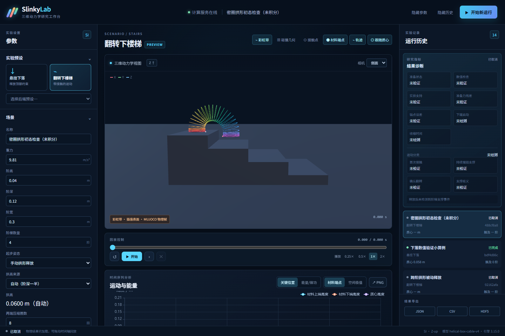
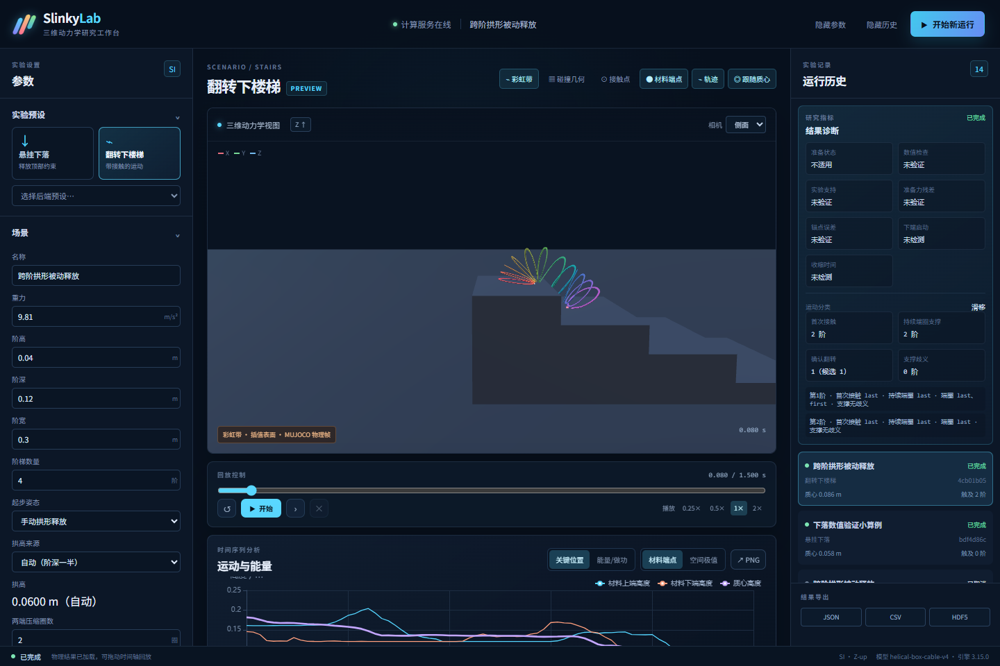

# Slinky Lab · 彩虹圈三维动力学研究平台

一个在浏览器中设置、计算、回放和比较彩虹圈运动的研究工作台。Python/MuJoCo 在独立进程中进行三维动力学计算，浏览器以 Three.js 显示实际杆段位姿。支持悬挂释放、楼梯接触、参数扫描、曲线、参考 CSV 对比及可复现的数据导出。

v0.1.0 为研究预览。3圈下落数值基准和39圈静态长度拟合已有报告；楼梯停止、滑移和侧落有实际算例，粗离散观察到连续三阶翻转，但步长与网格验收未通过。新增参考手动弯曲起步的跨阶拱形预设，仍需步态验证。完整验收状态见 [实际验证报告](docs/validation-results.json)，暂不提供 `latest`。



## Ubuntu 启动

安装 Docker Engine 后运行：

```bash
docker run -d --init --name slinky-lab \
  -p 127.0.0.1:8000:8000 \
  -v slinky-data:/data \
  ghcr.io/fanyu-nijika/slinky-lab:v0.1.0
```

在浏览器打开 <http://localhost:8000>。也可以下载本仓库的 `compose.yaml`，执行 `docker compose up -d`。镜像目标平台为 Linux x86-64；动力学使用 CPU，三维显示使用浏览器 WebGL。容器不需要 X11、CUDA 或宿主机安装 MuJoCo。

`slinky-data` 保存运行配置、轨迹和指标。删除容器不会删除命名数据卷。升级前请备份数据卷，使用版本标签或镜像摘要复现实验。

## 工作流程

1. 选择场景和预设，检查每个预设的参数来源与验证状态。
2. 设置物理参数和数值精度，开始计算。悬挂场景先完成受约束的准备过程再释放。
3. 查看进度、三维形变、接触点和指标。暂停后可单步；取消会保留已保存的数据。
4. 用时间轴回放已经得到的帧；播放倍速不改变求解器时间步长。
5. 导出配置、轨迹、指标或图表；用相同配置运行精细档、参数扫描或参考数据对比。

修改物理参数会创建新的运行记录。预览与精细档保持相同的圈数、质量、几何和材料参数，只改变数值离散设置。精细计算可能慢于现实时间，实际速度显示在运行状态中。

首次打开默认载入3圈下落验证小算例。12圈与39圈的CPU计算更慢；悬挂准备期间也可暂停或取消。准备阶段暂停后第一次单步会完成准备并停在首帧，随后单步推进一个显示采样间隔。

对照弹簧圈下楼视频时，可选“楼梯拱形释放”或“密圈拱形释放”。它们将首端放在上阶、自由端悬在下阶上方，中部已被手动弯曲；开始计算后显示原生模型产生的形态。侧视与“材料端点”便于检查交替支撑。密圈预设的CPU计算明显更慢，全部参数均为演示假设，不能视为视频中实物的测量结果。

12圈拱形预设的实际1.5秒释放得到滑移，尚未连续换端；下图为该原生轨迹的0.080秒帧。初态形状接近演示现象，不等于连续步态已复现。



## 模型与证据边界

模型是一条具有矩形截面的离散螺旋弹性杆，使用 MuJoCo `elasticity.cable` 的弯曲和扭转力，以及真实杆段之间、杆段与台阶之间的接触。杆的材料中心线近似不可伸长；彩虹圈整体仍可通过弯曲和扭转产生很大的伸缩。

文献的整体弹簧刚度单位为 N/m，插件的材料模量单位为 Pa，两者不是同一参数。预设标明文献数值、假设数值和标定信息；演示预设的视觉效果不能替代实验验证。数值收敛、模型拟合和实验支持分别记录。

MuJoCo 的内建势能不含 cable 插件的弹性能。平台将动能、重力势能及累计弹性/阻尼/接触做功分开报告，并提供数值功率平衡诊断。碰撞和摩擦存在时机械能可以耗散。

参考与局限见 [模型说明](docs/model.md)、[参数来源](docs/sources.md)、[验证说明](docs/validation.md)。

## 本地开发

需要 Python 3.12 和 Node.js 22。

```bash
python -m venv .venv
source .venv/bin/activate
pip install --require-hashes -r requirements.lock
pip install -e '.[test]'
cd frontend
npm ci
npm run build
cd ..
slinky-lab serve --host 127.0.0.1 --port 8000
```

Windows 使用 `.venv\Scripts\activate`。后端优先读取 `SLINKY_STATIC_DIR`，开发时使用 `frontend/dist`；`SLINKY_DATA_DIR` 指定数据目录。前端独立开发可执行 `npm run dev`，Vite 将 API 代理到本机 8000 端口。

```bash
pytest -q
cd frontend
npm run build
npx playwright install chromium
npm test
```

接口文档：<http://localhost:8000/docs>。CLI 用法：`slinky-lab --help`。前后端都以 `RunConfig` 为运行配置；坐标系 Z 向上、单位 m/kg/s，传输四元数顺序为 w/x/y/z。

## 构建与发布

GitHub Actions 执行 Python 测试、前端构建和浏览器测试，再构建容器进行健康及真实计算检查。版本发布工作流将经过测试的 Linux 镜像推送到 GHCR，并保存提交标签与镜像摘要。发布流程的最后一步检查公开镜像能否匿名拉取。

```bash
docker build -t slinky-lab:local .
docker run --rm --init -p 127.0.0.1:8000:8000 -v slinky-data:/data slinky-lab:local
```

公开仓库仅包含平台代码、生成的测试数据、来源索引与验证报告。引用文献和作者视频通过原始链接访问。
